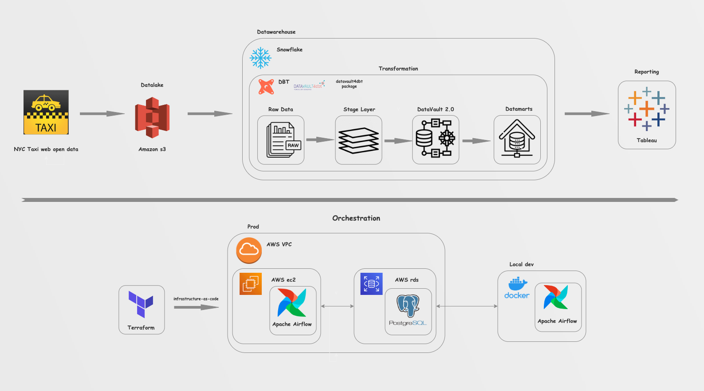
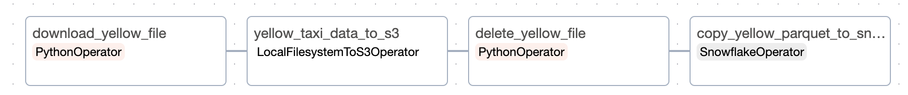
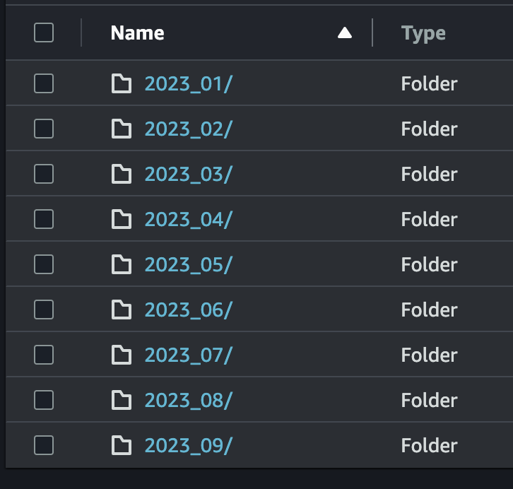
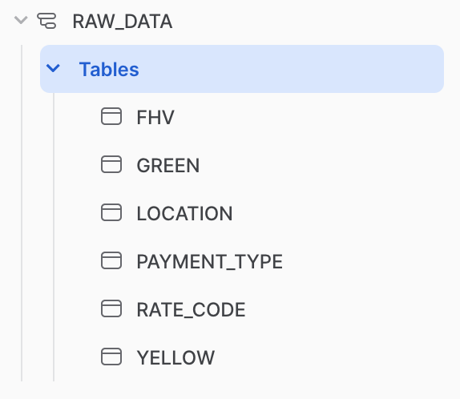

# Project Description #

## Objective and Problem for Solution ##

The goal of the project was to build an end-to-end architecture for delivering raw data for subsequent analysis and visualization of results.

### Data description: ###
The New York City Taxi and Limousine Commission (TLC) open web data.

Source: https://www.nyc.gov/site/tlc/about/tlc-trip-record-data.page 
TLC Trip Records User Guide: https://www.nyc.gov/assets/tlc/downloads/pdf/trip_record_user_guide.pdf 
Taxi Lookup Table: https://d37ci6vzurychx.cloudfront.net/misc/taxi+_zone_lookup.csv

## Solution Architecture ##

### Orchestration infrastructure: ###

**Apache Airflow** was chosen as main tool for orchestration. 

**Production:** 
With a help of **Terraform infrastructure-as-code** paradigm following 
infrastructure deployed: 
* **AWS ec2** instance with Airflow
* **AWS rds** instance with PostgreSQL
* **AWS vpc** with secure connection inside between Airflow and PostgreSQL

**Local development:** 
**Docker** container with Airflow was created for local development.

### Raw data delivery: ###

Raw data is stored in **PARQUET** files by link below (monthly data by every 
service).

**AWS S3** was chosen as the solution for the **Datalake**. 
**Snowflake** was chosen as the solution for the **Datawarehouse**. 

To upload data from web to Datalake and DWH **Airflow** was used. 
DAG contains several tasks:
* download_file (download file from web and save it locally)
* upload_to_s3 (upload file from local to s3 bucket)
* delete_file (delete file locally)
* copy_file_to_snowflake

**TODO**: 
In production DAG should be separated to two parts: download file 
and upload it to s3.
After another DAG should be triggered to COPY file to Snoflake. 

**S3 bucket structure:**
 
 

**Snowflake RAW_DATA structure:** 
 